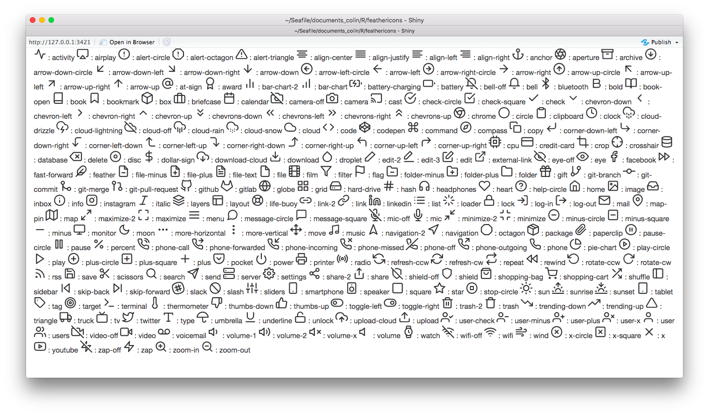

<!-- README.md is generated from README.Rmd. Please edit that file -->

# feathericons

The goal of {feathericons} is to give access to feathericons svg icons
in Shiny.

More about Feather Icons on <https://feathericons.com/>

## Installation

You can install the dev version of feathericons from GitHub:

``` r
remotes::install_github("ColinFay/feathericons")
```

## How to use

You’ll need to call `use_feather_icons` in your Shiny UI. Then, an icon
is added with `feather_icons`, which takes as arguments the name of the
icon.

``` r
library(shiny)
library(feathericons)

ui <- fluidPage(
  use_feather_icons(), 
  tags$p(feather_icons("circle"), "Log in")
)

server <- function(input, output, session) {
  
}

shinyApp(ui, server)
```

## List of icons

The list is available as a vector:

``` r
feathericons::icons_list
#>   [1] "activity"           "airplay"            "alert-circle"      
#>   [4] "alert-octagon"      "alert-triangle"     "align-center"      
#>   [7] "align-justify"      "align-left"         "align-right"       
#>  [10] "anchor"             "aperture"           "archive"           
#>  [13] "arrow-down-circle"  "arrow-down-left"    "arrow-down-right"  
#>  [16] "arrow-down"         "arrow-left-circle"  "arrow-left"        
#>  [19] "arrow-right-circle" "arrow-right"        "arrow-up-circle"   
#>  [22] "arrow-up-left"      "arrow-up-right"     "arrow-up"          
#>  [25] "at-sign"            "award"              "bar-chart-2"       
#>  [28] "bar-chart"          "battery-charging"   "battery"           
#>  [31] "bell-off"           "bell"               "bluetooth"         
#>  [34] "bold"               "book-open"          "book"              
#>  [37] "bookmark"           "box"                "briefcase"         
#>  [40] "calendar"           "camera-off"         "camera"            
#>  [43] "cast"               "check-circle"       "check-square"      
#>  [46] "check"              "chevron-down"       "chevron-left"      
#>  [49] "chevron-right"      "chevron-up"         "chevrons-down"     
#>  [52] "chevrons-left"      "chevrons-right"     "chevrons-up"       
#>  [55] "chrome"             "circle"             "clipboard"         
#>  [58] "clock"              "cloud-drizzle"      "cloud-lightning"   
#>  [61] "cloud-off"          "cloud-rain"         "cloud-snow"        
#>  [64] "cloud"              "code"               "codepen"           
#>  [67] "command"            "compass"            "copy"              
#>  [70] "corner-down-left"   "corner-down-right"  "corner-left-down"  
#>  [73] "corner-left-up"     "corner-right-down"  "corner-right-up"   
#>  [76] "corner-up-left"     "corner-up-right"    "cpu"               
#>  [79] "credit-card"        "crop"               "crosshair"         
#>  [82] "database"           "delete"             "disc"              
#>  [85] "dollar-sign"        "download-cloud"     "download"          
#>  [88] "droplet"            "edit-2"             "edit-3"            
#>  [91] "edit"               "external-link"      "eye-off"           
#>  [94] "eye"                "facebook"           "fast-forward"      
#>  [97] "feather"            "file-minus"         "file-plus"         
#> [100] "file-text"          "file"               "film"              
#> [103] "filter"             "flag"               "folder-minus"      
#> [106] "folder-plus"        "folder"             "gift"              
#> [109] "git-branch"         "git-commit"         "git-merge"         
#> [112] "git-pull-request"   "github"             "gitlab"            
#> [115] "globe"              "grid"               "hard-drive"        
#> [118] "hash"               "headphones"         "heart"             
#> [121] "help-circle"        "home"               "image"             
#> [124] "inbox"              "info"               "instagram"         
#> [127] "italic"             "layers"             "layout"            
#> [130] "life-buoy"          "link-2"             "link"              
#> [133] "linkedin"           "list"               "loader"            
#> [136] "lock"               "log-in"             "log-out"           
#> [139] "mail"               "map-pin"            "map"               
#> [142] "maximize-2"         "maximize"           "menu"              
#> [145] "message-circle"     "message-square"     "mic-off"           
#> [148] "mic"                "minimize-2"         "minimize"          
#> [151] "minus-circle"       "minus-square"       "minus"             
#> [154] "monitor"            "moon"               "more-horizontal"   
#> [157] "more-vertical"      "move"               "music"             
#> [160] "navigation-2"       "navigation"         "octagon"           
#> [163] "package"            "paperclip"          "pause-circle"      
#> [166] "pause"              "percent"            "phone-call"        
#> [169] "phone-forwarded"    "phone-incoming"     "phone-missed"      
#> [172] "phone-off"          "phone-outgoing"     "phone"             
#> [175] "pie-chart"          "play-circle"        "play"              
#> [178] "plus-circle"        "plus-square"        "plus"              
#> [181] "pocket"             "power"              "printer"           
#> [184] "radio"              "refresh-ccw"        "refresh-cw"        
#> [187] "repeat"             "rewind"             "rotate-ccw"        
#> [190] "rotate-cw"          "rss"                "save"              
#> [193] "scissors"           "search"             "send"              
#> [196] "server"             "settings"           "share-2"           
#> [199] "share"              "shield-off"         "shield"            
#> [202] "shopping-bag"       "shopping-cart"      "shuffle"           
#> [205] "sidebar"            "skip-back"          "skip-forward"      
#> [208] "slack"              "slash"              "sliders"           
#> [211] "smartphone"         "speaker"            "square"            
#> [214] "star"               "stop-circle"        "sun"               
#> [217] "sunrise"            "sunset"             "tablet"            
#> [220] "tag"                "target"             "terminal"          
#> [223] "thermometer"        "thumbs-down"        "thumbs-up"         
#> [226] "toggle-left"        "toggle-right"       "trash-2"           
#> [229] "trash"              "trending-down"      "trending-up"       
#> [232] "triangle"           "truck"              "tv"                
#> [235] "twitter"            "type"               "umbrella"          
#> [238] "underline"          "unlock"             "upload-cloud"      
#> [241] "upload"             "user-check"         "user-minus"        
#> [244] "user-plus"          "user-x"             "user"              
#> [247] "users"              "video-off"          "video"             
#> [250] "voicemail"          "volume-1"           "volume-2"          
#> [253] "volume-x"           "volume"             "watch"             
#> [256] "wifi-off"           "wifi"               "wind"              
#> [259] "x-circle"           "x-square"           "x"                 
#> [262] "youtube"            "zap-off"            "zap"               
#> [265] "zoom-in"            "zoom-out"
```

## All current supported icons :

Run this chunk to get all supported icons and the results:

``` r
library(shiny)

ui <- fluidPage(
  use_feather_icons(),
  lapply(icons_list, function(x){
    HTML(feather_icons(x), ":", x)
    }
    )
)

server <- function(input, output, session) {
  
}

shinyApp(ui, server)
```



Please note that this project is released with a [Contributor Code of
Conduct](CODE_OF_CONDUCT.md). By participating in this project you agree
to abide by its terms.
